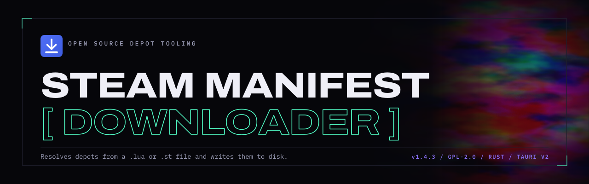

<div align="center">



**A sleek desktop app for downloading Steam game depots, adding them to Steam, and patching them with gbe_fork — all in one pipeline.**


[](https://tokei.kojix2.net/github/MCbabel/Steam-Manifest-Downloader)

Upload `.lua` files or search by App ID across configurable sources (GitHub, archive.org, plain HTTPS folders). The app aggregates depots from every source, downloads them via the integrated DepotDownloaderMod engine, optionally creates Steam library entries with full grid art, and can even patch games with the gbe_fork emulator + Steamless DRM removal.

</div>

> [!WARNING]
> ## ⚠️ Legal Disclaimer
>
> This project does **NOT** support or encourage piracy in any way.
>
> - **DepotDownloaderMod** must **ONLY** be used with your own legally obtained Steam keys.
> - This tool is intended for **legitimate use cases only** (e.g., downloading your own purchased content, archiving, backup, etc.).
> - The developer takes **no responsibility** for any misuse of this tool.
> - By using this software, you agree to comply with all applicable laws and Steam's Terms of Service.

---

## ✨ Features

| | Feature |
|---|---|
| 📂 | **Drag & drop** `.lua` / `.vdf` / `.st` upload |
| 🔍 | **Configurable depot sources** — GitHub, archive.org, plain HTTPS; all queried in parallel and merged |
| 🏷️ | **Live depot metadata** — Windows / Linux / macOS, 32/64-bit and language tags via Steam PICS |
| 🔑 | **Automatic depot keys** generation |
| ⚡ | **Integrated DepotDownloaderMod** execution |
| 📊 | **Real-time progress** with per-depot speed + ETA |
| 🎮 | **Steam Store API** integration — game names + cover art |
| 🖼️ | **Add to Steam Library** — non-Steam shortcut with banner / hero / logo / icon (Linux step + Windows toggle) |
| 🔧 | **gbe_fork emulator** patching — Regular + Experimental variants, 21 settings, lobby_connect launcher |
| 🛡️ | **DRM detection & removal** via Steamless (works through `mono` on Linux) |
| 🪝 | **Steam-API-Check Bypass** — bundled `version.dll` hijack for stubborn integrity checks |
| 🌙 | **Dark / Light theme** + English & German localisation |
| 🔒 | **Fully self-contained** — DepotDownloaderMod embedded |

### 📌 Scope

**Public branch only.** SMD reads the `public` branch from Steam PICS over an
anonymous connection. Private and password-protected beta branches are out of
scope, and the encrypted manifest IDs they use are never decrypted.

Depot **content** is a separate matter: decryption keys come from your
configured depot sources, and the depots you select are decrypted with them.

Looking for builds from a beta or dev branch of a game you own?
[DepotDownloader](https://github.com/SteamRE/DepotDownloader) covers that with
`-branch` / `-betapassword`. It signs in as your account, so ownership grants
the access.

---

## 🚀 Quick Start

1. 📥 **Install** — grab the latest build from [Releases](../../releases) (NSIS for Windows, AppImage for Linux, AUR for Arch)
2. 🌍 **First launch** — pick your language, accept or decline anonymous telemetry, done

Then walk through the 5-step pipeline:

| Step | What it does |
|---|---|
| 1 · Upload | Drop a `.lua` / `.vdf` / `.st` file or search by App ID |
| 2 · Select | Pick depots — each row shows OS / arch / language tags from Steam PICS |
| 3 · Download | Integrated DepotDownloaderMod streams every selected depot |
| 4 · Shortcuts / Steam Library | Optional — Windows shortcut or non-Steam Steam library entry with grid art |
| 5 · Emulator | Optional — patch with gbe_fork, remove DRM via Steamless, install API-check bypass |

---

## 💻 System Requirements

| | Requirement | Details |
|---|---|---|
| 💻 | **Operating System** | Windows 10 / 11 (64-bit) or a modern Linux distro (glibc ≥ 2.35) |
| ⚙️ | **Runtime (Windows)** | [.NET 9.0 Desktop Runtime](https://dotnet.microsoft.com/en-us/download/dotnet/thank-you/runtime-desktop-9.0.16-windows-x64-installer) — required by DepotDownloader |
| 📦 | **Runtime (Linux)** | `webkit2gtk-4.1`, `libayatana-appindicator3`, `librsvg2` (install commands below) |
| 🌐 | **Network** | Internet connection |

---

## 📥 Installation

### 🪟 Windows

1. Head to the [**Releases**](../../releases) page and download the latest `.exe` installer (NSIS)
2. Run the installer — installs per-user, **no admin required**
3. Launch **Steam Manifest Downloader** from the Start Menu

> [!NOTE]
> Make sure you have the [.NET 9.0 Desktop Runtime](https://dotnet.microsoft.com/en-us/download/dotnet/thank-you/runtime-desktop-9.0.16-windows-x64-installer) installed. The app will warn you on first launch if it's missing.

### 🐧 Linux

#### Arch / CachyOS / Manjaro — AUR

The cleanest path on Arch-based distros: an official AUR package handled by `pacman`. Two variants:

```bash
# Precompiled — installs in seconds, pulls the AppImage binary from the GitHub release
paru -S steam-manifest-downloader-bin

# From source — recompiles the Rust binary locally (~5 min on a modern CPU)
paru -S steam-manifest-downloader
```

Both packages `provide`/`conflict` each other, so you only ever have one installed. The `-bin` flavor is recommended unless you want a reproducible local build.

Sources: [steam-manifest-downloader-bin](https://aur.archlinux.org/packages/steam-manifest-downloader-bin) · [steam-manifest-downloader](https://aur.archlinux.org/packages/steam-manifest-downloader). Updates flow through your package manager (`paru -Syu`), and the in-app updater detects this and points you back at it instead of fetching an AppImage.

#### Other distros — AppImage

Download the latest `.AppImage` from [**Releases**](../../releases).

Tauri apps on Linux don't bundle their own browser engine — they render the UI through the system **WebKitGTK**. Install the runtime for your distro:

<details>
<summary><b>Ubuntu / Debian</b> (22.04+ / 12+)</summary>

```bash
sudo apt install libwebkit2gtk-4.1-0 libayatana-appindicator3-1 librsvg2-2
```
</details>

<details>
<summary><b>Arch / CachyOS / Manjaro</b></summary>

```bash
sudo pacman -S webkit2gtk-4.1 libayatana-appindicator librsvg
```
</details>

<details>
<summary><b>Fedora</b></summary>

```bash
sudo dnf install webkit2gtk4.1 libappindicator-gtk3 librsvg2
```
</details>

<details>
<summary><b>openSUSE</b> (Tumbleweed / Leap 15.6+)</summary>

```bash
sudo zypper install libwebkit2gtk-4_1-0 libayatana-appindicator3-1 librsvg-2-2
```
</details>

Then make the AppImage executable and launch it:

```bash
chmod +x Steam\ Manifest\ Downloader_*_amd64.AppImage
./Steam\ Manifest\ Downloader_*_amd64.AppImage
```

> [!NOTE]
> On **NixOS**, portable binaries can't find system libs through the normal loader paths. Launch via `steam-run ./Steam\ Manifest\ Downloader_*_amd64.AppImage`, or wrap the binary in a Nix derivation that lists `webkitgtk_4_1`, `libayatana-appindicator`, `librsvg` and `gtk3` as build inputs.

<details>
<summary><b>🔧 Building from Source</b></summary>

### Prerequisites

- **Rust** (latest stable) + **Cargo** — [Install via rustup](https://rustup.rs/)
- **Tauri CLI** — `cargo install tauri-cli`
- **.NET 9.0 Desktop Runtime** — Required to run the embedded DepotDownloaderMod ([Download](https://dotnet.microsoft.com/en-us/download/dotnet/thank-you/runtime-desktop-9.0.16-windows-x64-installer))
- **Mono** *(Linux/macOS, optional)* — Only needed for step 5's DRM removal via Steamless: `pacman -S mono` / `apt install mono-runtime` / `brew install mono`
- **Linux additional:** `libwebkit2gtk-4.1-dev`, `libappindicator3-dev`, `librsvg2-dev`, `patchelf` (for AppImage)

---

### Step 1: Building DepotDownloaderMod (optional)

The project embeds DepotDownloaderMod binaries at compile time. **Pre-built versions are already included** in the repo:

- `DepotDownloaderMod-Windows/` — Windows build (framework-dependent, requires .NET runtime)
- `DepotDownloaderMod-linux-full/` — Linux build (self-contained, no runtime needed)

If you want to build DepotDownloaderMod yourself:

**Source:** [github.com/SteamAutoCracks/DepotDownloaderMod](https://github.com/SteamAutoCracks/DepotDownloaderMod)

#### Windows (framework-dependent)

```bash
git clone https://github.com/SteamAutoCracks/DepotDownloaderMod.git
cd DepotDownloaderMod
dotnet publish -c Release -o ./publish-windows
```

Copy **all** files from `publish-windows/` to `DepotDownloaderMod-Windows/` in this project:

- `DepotDownloaderMod.exe`
- `DepotDownloaderMod.dll`
- `DepotDownloaderMod.deps.json`
- `DepotDownloaderMod.runtimeconfig.json`
- `SteamKit2.dll`
- `protobuf-net.Core.dll`
- `protobuf-net.dll`
- `QRCoder.dll`
- `System.IO.Hashing.dll`
- `ZstdSharp.dll`

#### Linux (self-contained, NO trimming)

```bash
git clone https://github.com/SteamAutoCracks/DepotDownloaderMod.git
cd DepotDownloaderMod
dotnet publish -c Release -r linux-x64 --self-contained true \
    -p:PublishSingleFile=true -o ./publish-linux
```

> [!CAUTION]
> **Do NOT use `-p:PublishTrimmed=true`** — .NET trimming removes reflection metadata needed by SteamKit2/protobuf-net, causing "A task was canceled" errors at runtime.

Copy `publish-linux/DepotDownloaderMod` to `DepotDownloaderMod-linux-full/DepotDownloaderMod` in this project.

---

### Step 2: Building the Tauri App

#### Windows

```bash
cargo tauri build
```

Output:
- **NSIS installer:** `src-tauri/target/release/bundle/nsis/`
- **Portable executable:** `src-tauri/target/release/steam-manifest-downloader.exe`

#### Linux (Arch/CachyOS/etc.)

```bash
NO_STRIP=true APPIMAGE_EXTRACT_AND_RUN=1 cargo tauri build
```

Output: `src-tauri/target/release/bundle/appimage/Steam Manifest Downloader_<version>_amd64.AppImage`

> [!NOTE]
> `NO_STRIP=true` prevents stripping symbols from the embedded .NET binary. `APPIMAGE_EXTRACT_AND_RUN=1` is needed on some distros for the AppImage bundler.

---

### Project Structure (for reference)

The `include_bytes!` macro in `src-tauri/src/services/embedded_tools.rs` embeds the DDM binaries at compile time:

- **Windows build** reads from `DepotDownloaderMod-Windows/`
- **Linux build** reads from `DepotDownloaderMod-linux-full/`

> [!IMPORTANT]
> The DDM binary files **must be in place before** running `cargo tauri build`. The Rust compiler reads them via `include_bytes!` at compile time — if the files are missing, the build will fail.

</details>

---

## 🛠️ Tech Stack

<div align="center">


</div>

| Layer | Technology |
|---|---|
| **Backend** | Rust, reqwest, tokio, serde |
| **Frontend** | HTML / CSS / JS (vanilla) |
| **Framework** | Tauri v2 |
| **Downloader** | DepotDownloaderMod (.NET 9) |
| **Emulator** | gbe_fork (downloaded on demand from GitHub releases) |
| **DRM tooling** | Steamless v3.1.0.5 (CC-BY-NC-ND), Steam-API-Check-Bypass |

---

<details>
<summary><b>📁 Project Structure</b></summary>

```
DepoDownloaderWebApp/
├── public/                     # Frontend (HTML/CSS/JS)
│   ├── index.html              # Main UI
│   ├── css/style.css           # Styles & themes
│   └── js/app.js               # Application logic
├── src-tauri/
│   ├── src/
│   │   ├── main.rs             # Tauri entry point
│   │   ├── commands/           # Tauri command handlers
│   │   │   ├── download.rs     # Download orchestration
│   │   │   ├── search.rs       # Game search
│   │   │   ├── file_ops.rs     # File operations
│   │   │   ├── settings.rs     # App settings
│   │   │   ├── system.rs       # System utilities
│   │   │   └── window.rs       # Window controls
│   │   └── services/           # Business logic
│   │       ├── github_api.rs   # GitHub API client
│   │       ├── manifest_hub_api.rs
│   │       ├── steam_store_api.rs
│   │       ├── depot_runner.rs # DepotDownloaderMod runner
│   │       ├── lua_parser.rs   # .lua file parser
│   │       └── ...
│   ├── Cargo.toml              # Rust dependencies
│   └── tauri.conf.json         # Tauri configuration
├── DepotDownloaderMod/         # Embedded .NET tool
├── assets/                     # App icons
└── README.md
```

</details>

---

## 📄 License

<div align="center">


This project is licensed under the [GPL-2.0 License](LICENSE).

</div>

---

## 🙏 Credits & Acknowledgments

- **[DepotDownloaderMod](https://github.com/SteamAutoCracks/DepotDownloaderMod)** — Steam depot downloading engine
- **[Steam Store API](https://store.steampowered.com/api/)** — Game metadata & artwork
- **[Tauri](https://v2.tauri.app/)** — Desktop application framework
- **[gbe_fork](https://github.com/Detanup01/gbe_fork)** — Steamworks API emulator (downloaded on demand)
- **[Steamless](https://github.com/atom0s/Steamless)** by atom0s — SteamStub DRM unpacker (downloaded on demand)
- **[api.steamcmd.net](https://api.steamcmd.net/)** — public Steam PICS mirror for depot metadata tags

---

<div align="center">

Made with ❤️ and 🦀

</div>
