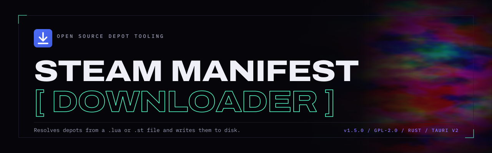

<div align="center">



**A sleek desktop app for downloading Steam game depots, adding them to Steam, and patching them with gbe_fork — all in one pipeline.**


[](https://tokei.kojix2.net/github/MCbabel/Steam-Manifest-Downloader)

Upload `.lua` files or search by App ID across configurable sources (GitHub, archive.org, plain HTTPS folders). The app aggregates depots from every source, downloads them via the integrated DepotDownloaderMod engine, optionally creates Steam library entries with full grid art, and can even patch games with the gbe_fork emulator + Steamless DRM removal.

</div>

> [!WARNING]
> ## ⚠️ Legal Disclaimer
>
> This project does **NOT** support or encourage piracy in any way.
>
> - **DepotDownloaderMod** must **ONLY** be used with your own legally obtained Steam keys.
> - This tool is intended for **legitimate use cases only** (e.g., downloading your own purchased content, archiving, backup, etc.).
> - The developer takes **no responsibility** for any misuse of this tool.
> - By using this software, you agree to comply with all applicable laws and Steam's Terms of Service.

---

## ✨ Features

| | Feature |
|---|---|
| 📂 | **Drag & drop** `.lua` / `.vdf` / `.st` upload |
| 🔍 | **Configurable depot sources** — GitHub, archive.org, plain HTTPS; all queried in parallel and merged |
| 🏷️ | **Live depot metadata** — Windows / Linux / macOS, 32/64-bit and language tags via Steam PICS |
| 🔑 | **Automatic depot keys** generation |
| ⚡ | **Integrated DepotDownloaderMod** execution |
| 📊 | **Real-time progress** with per-depot speed + ETA |
| 🔄 | **Update downloaded games** — from the history, only changed files are downloaded and files removed from the game are deleted |
| 🐢 | **Speed limit** — cap downloads at e.g. 10 MB/s or 75 Mbit/s, also while a download is running |
| ⏻ | **Shut down when finished** — optional, with a 60 second countdown that can be cancelled; the next start offers to continue with the skipped steps |
| 🎮 | **Steam Store API** integration — game names + cover art |
| 🖼️ | **Add to Steam Library** — non-Steam shortcut with banner / hero / logo / icon (Linux step + Windows toggle) |
| 🔧 | **gbe_fork emulator** patching — Regular + Experimental variants, 21 settings, lobby_connect launcher |
| 🛡️ | **DRM detection & removal** via Steamless (works through `mono` on Linux) |
| 🪝 | **Steam-API-Check Bypass** — bundled `version.dll` hijack for stubborn integrity checks |
| 🌙 | **Dark / Light theme** + English & German localisation |
| 🔒 | **Fully self-contained** — DepotDownloaderMod embedded |
| 🖥️ | **Terminal version** — full mouse-driven TUI plus headless CLI for servers & Docker ([details](#%EF%B8%8F-terminal-version-tui--cli)) |

### 📌 Scope

**Public branch only.** SMD reads the `public` branch from Steam PICS over an
anonymous connection. Private and password-protected beta branches are out of
scope, and the encrypted manifest IDs they use are never decrypted.

Depot **content** is a separate matter: decryption keys come from your
configured depot sources, and the depots you select are decrypted with them.

Looking for builds from a beta or dev branch of a game you own?
[DepotDownloader](https://github.com/SteamRE/DepotDownloader) covers that with
`-branch` / `-betapassword`. It signs in as your account, so ownership grants
the access.

---

## 🚀 Quick Start

1. 📥 **Install** — grab the latest build from [Releases](../../releases) (NSIS for Windows, AppImage for Linux, AUR for Arch, `smd` for the terminal)
2. 🌍 **First launch** — pick your language, accept or decline anonymous telemetry, done

Then walk through the 5-step pipeline:

| Step | What it does |
|---|---|
| 1 · Upload | Drop a `.lua` / `.vdf` / `.st` file or search by App ID |
| 2 · Select | Pick depots — each row shows OS / arch / language tags from Steam PICS |
| 3 · Download | Integrated DepotDownloaderMod streams every selected depot |
| 4 · Shortcuts / Steam Library | Optional — Windows shortcut or non-Steam Steam library entry with grid art |
| 5 · Emulator | Optional — patch with gbe_fork, remove DRM via Steamless, install API-check bypass |

---

## 💻 System Requirements

| | Requirement | Details |
|---|---|---|
| 💻 | **Operating System** | Windows 10 / 11 (64-bit) or a modern Linux distro (glibc ≥ 2.35) |
| ⚙️ | **Runtime (Windows)** | Nothing extra for the default built-in downloader. The optional DepotDownloaderMod engine needs the [.NET 9.0 Desktop Runtime](https://dotnet.microsoft.com/en-us/download/dotnet/thank-you/runtime-desktop-9.0.16-windows-x64-installer) |
| 📦 | **Runtime (Linux)** | `webkit2gtk-4.1`, `libayatana-appindicator3`, `librsvg2` (install commands below) |
| 🌐 | **Network** | Internet connection |

---

## 📥 Installation

### 🪟 Windows

Two options on the [**Releases**](../../releases) page, neither needs admin rights:

| | Download | What it is |
|---|---|---|
| 🧰 | `Steam-Manifest-Downloader_<version>_windows-standalone.zip` | **Standalone, no install.** Extract the ZIP into a folder of your own (e.g. Documents) and start `Steam Manifest Downloader.exe`. Already contains everything the emulator step needs (gbe_fork, Steamless, Steam API bypass), so it works without extra downloads. Instructions in German and English are inside the ZIP. |
| 📦 | `Steam Manifest Downloader_<version>_x64-setup.exe` | **Installer.** Installs per user and adds a Start Menu entry. Downloads the emulator tools the first time you use that step. |

> [!NOTE]
> The default built-in downloader needs no .NET runtime. Only if you switch to the DepotDownloaderMod engine in the settings, install the [.NET 9.0 Desktop Runtime](https://dotnet.microsoft.com/en-us/download/dotnet/thank-you/runtime-desktop-9.0.16-windows-x64-installer); the app tells you if it's missing.

### 🐧 Linux

#### Arch / CachyOS / Manjaro — AUR

The cleanest path on Arch-based distros: an official AUR package handled by `pacman`. Two variants:

```bash
# Precompiled — installs in seconds, pulls the AppImage binary from the GitHub release
paru -S steam-manifest-downloader-bin

# From source — recompiles the Rust binary locally (~5 min on a modern CPU)
paru -S steam-manifest-downloader
```

Both packages `provide`/`conflict` each other, so you only ever have one installed. The `-bin` flavor is recommended unless you want a reproducible local build.

Sources: [steam-manifest-downloader-bin](https://aur.archlinux.org/packages/steam-manifest-downloader-bin) · [steam-manifest-downloader](https://aur.archlinux.org/packages/steam-manifest-downloader). Updates flow through your package manager (`paru -Syu`), and the in-app updater detects this and points you back at it instead of fetching an AppImage.

#### Other distros — AppImage

Download the latest `.AppImage` from [**Releases**](../../releases).

Tauri apps on Linux don't bundle their own browser engine — they render the UI through the system **WebKitGTK**. Install the runtime for your distro:

<details>
<summary><b>Ubuntu / Debian</b> (22.04+ / 12+)</summary>

```bash
sudo apt install libwebkit2gtk-4.1-0 libayatana-appindicator3-1 librsvg2-2
```
</details>

<details>
<summary><b>Arch / CachyOS / Manjaro</b></summary>

```bash
sudo pacman -S webkit2gtk-4.1 libayatana-appindicator librsvg
```
</details>

<details>
<summary><b>Fedora</b></summary>

```bash
sudo dnf install webkit2gtk4.1 libappindicator-gtk3 librsvg2
```
</details>

<details>
<summary><b>openSUSE</b> (Tumbleweed / Leap 15.6+)</summary>

```bash
sudo zypper install libwebkit2gtk-4_1-0 libayatana-appindicator3-1 librsvg-2-2
```
</details>

Then make the AppImage executable and launch it:

```bash
chmod +x Steam\ Manifest\ Downloader_*_amd64.AppImage
./Steam\ Manifest\ Downloader_*_amd64.AppImage
```

> [!NOTE]
> On **NixOS**, portable binaries can't find system libs through the normal loader paths. Launch via `steam-run ./Steam\ Manifest\ Downloader_*_amd64.AppImage`, or wrap the binary in a Nix derivation that lists `webkitgtk_4_1`, `libayatana-appindicator`, `librsvg` and `gtk3` as build inputs.

---

## 🖥️ Terminal Version (TUI & CLI)

`smd` is a single binary that brings the whole app into the terminal: no WebView,
no browser engine, no installer. Run it without arguments for the interactive UI,
or use the subcommands on a server, in Docker or in scripts.

**Download:** `Steam-Manifest-Downloader-Terminal_<version>_linux-x64` or `Steam-Manifest-Downloader-Terminal_<version>_windows-x64.exe`
from [**Releases**](../../releases).

With the default download engine (the built-in native downloader) `smd` needs
nothing else: no .NET runtime, and the Linux build is static, so it runs on any
distro including Alpine. Only if you switch the engine to DepotDownloaderMod in
the settings, the same requirements as the desktop app apply: the
[.NET 9.0 Runtime](https://dotnet.microsoft.com/en-us/download/dotnet/9.0) on
Windows, and a glibc-based distro on Linux (not Alpine).

```bash
chmod +x Steam-Manifest-Downloader-Terminal_*_linux-x64
./Steam-Manifest-Downloader-Terminal_*_linux-x64
```

### Interactive UI

All five steps of the desktop app (upload/search, depot selection, download,
shortcuts / Steam library, emulator patching) plus history and settings.
Everything is clickable — buttons, tabs, list rows (double-click opens),
checkboxes — and the mouse wheel scrolls. Keyboard works just as well:

| Key | Action |
|---|---|
| `Tab` / `Shift+Tab` | Move between fields, buttons and lists |
| `↑ ↓ ← →` | Move inside lists, between buttons elsewhere |
| `Enter` / `Space` | Press the focused button, toggle a checkbox, pick a list entry |
| `Esc` | Close a dialog or go back one step |
| `F2` `F3` `F4` | Download, History, Settings |
| `F1` | Help |
| `PgUp` / `PgDn` | Scroll long pages and the output log |
| `a` / `n`, `/`, `d` | Depot selection: all / none, filter, start download |
| `p` / `c` | While downloading: pause/resume, cancel |
| `r` `d` `u` `o` `e` `x` | History: resume, download again, update, open folder, edit emulator, remove |
| `Ctrl+Q` / `F10` | Quit (asks first while a download runs) |

Dragging a `.lua` / `.st` file onto the terminal window loads it right away
(most terminals paste the path). The UI uses true color where the terminal
supports it, falls back to the 16 terminal colors otherwise, and respects
`NO_COLOR`.

### Headless commands

```bash
smd search "Half-Life 2"            # find the App ID
smd search 220 --manifests 0        # sources + depots for an App ID
smd download 220 --list             # show what would be downloaded
smd download 220 --depots 221,222 -o /data/games
smd download game.lua --json        # progress as JSON lines
smd history
```

| Option / variable | Meaning |
|---|---|
| `-o` / `SMD_OUTPUT_DIR` | Download folder (defaults to the one from the settings) |
| `--data-dir` / `SMD_DATA_DIR` | Settings, history and caches. Defaults to the desktop app's directory, so both share their state |
| `--mh-key` / `SMD_MANIFESTHUB_KEY` | ManifestHub API key (fallback source and custom manifests) |
| `--manifest DEPOT=ID` | Pin a depot to a specific manifest (repeatable) |
| `--update <GAME_DIR>` | Update an existing download in place: only changed files are downloaded, files removed from the game are deleted |
| `--shutdown` | Shut down the computer when the download has finished (60 s countdown, Ctrl+C aborts) |
| `--speed-limit` / `SMD_SPEED_LIMIT` | Cap the download speed, e.g. `10MB/s` or `75Mbit/s` (`0` = unlimited, defaults to the setting) |
| `--json` | Machine-readable output |
| `-v` | Show backend diagnostics on stderr (otherwise written to a log file) |

Exit codes of `smd download`: `0` complete, `1` failed, `2` partially
downloaded (resumable), `130` interrupted.

### 🐳 Docker

Images are published to the GitHub Container Registry for every release and
every dev build. They are built for Intel/AMD processors (`linux/amd64`) and run
on Linux as well as on Windows and macOS with Docker Desktop; ARM devices such
as a Raspberry Pi are not supported yet.

| Tag | Content |
|---|---|
| `latest`, `1`, `1.4`, `1.4.3` | Latest stable release / that version |
| `dev`, `1.4.3-dev`, `dev-<commit>` | Latest dev build from the `dev` branch |

```bash
docker run --rm \
  -v smd-data:/data \
  -v "$PWD/games:/games" \
  ghcr.io/mcbabel/steam-manifest-downloader download 220
```

- Downloads go to `/games`, settings, history and caches to `/data`. Mount both
  so they survive the container.
- The container runs as user `smd` (UID 1000). A host folder mounted as
  `/games` must be writable for that UID (`sudo chown 1000:1000 games`), or run
  with `--user "$(id -u):$(id -g)"` and mount host folders for both `/data` and
  `/games`.
- `docker stop` and Ctrl+C cancel the download cleanly (exit code `130`), the
  same way as the cancel button in the UI.
- Pass a ManifestHub key with `-e SMD_MANIFESTHUB_KEY=...`.
- The interactive UI also works in a container: `docker run --rm -it -v smd-data:/data -v "$PWD/games:/games" ghcr.io/mcbabel/steam-manifest-downloader`. Without `-it` the image prints the help.
- The image uses the default native engine. The DepotDownloaderMod engine
  needs glibc and does not run in it.

Build the image yourself from source with `docker build -t smd .`.

<details>
<summary><b>🔧 Building from Source</b></summary>

### Prerequisites

- **Rust** (latest stable) + **Cargo** — [Install via rustup](https://rustup.rs/)
- **Tauri CLI** — `cargo install tauri-cli`
- **.NET 9.0 Desktop Runtime** — Required to run the embedded DepotDownloaderMod ([Download](https://dotnet.microsoft.com/en-us/download/dotnet/thank-you/runtime-desktop-9.0.16-windows-x64-installer))
- **Mono** *(Linux/macOS, optional)* — Only needed for step 5's DRM removal via Steamless: `pacman -S mono` / `apt install mono-runtime` / `brew install mono`
- **Linux additional:** `libwebkit2gtk-4.1-dev`, `libappindicator3-dev`, `librsvg2-dev`, `patchelf` (for AppImage)

---

### Step 1: Building DepotDownloaderMod (optional)

The project embeds DepotDownloaderMod binaries at compile time. **Pre-built versions are already included** in the repo:

- `src-core/vendor/ddm-windows/` — Windows build (framework-dependent, requires .NET runtime)
- `src-core/vendor/ddm-linux/` — Linux build (self-contained, no runtime needed)

If you want to build DepotDownloaderMod yourself:

**Source:** [github.com/SteamAutoCracks/DepotDownloaderMod](https://github.com/SteamAutoCracks/DepotDownloaderMod)

#### Windows (framework-dependent)

```bash
git clone https://github.com/SteamAutoCracks/DepotDownloaderMod.git
cd DepotDownloaderMod
dotnet publish -c Release -o ./publish-windows
```

Copy **all** files from `publish-windows/` to `src-core/vendor/ddm-windows/` in this project:

- `DepotDownloaderMod.exe`
- `DepotDownloaderMod.dll`
- `DepotDownloaderMod.deps.json`
- `DepotDownloaderMod.runtimeconfig.json`
- `SteamKit2.dll`
- `protobuf-net.Core.dll`
- `protobuf-net.dll`
- `QRCoder.dll`
- `System.IO.Hashing.dll`
- `ZstdSharp.dll`

#### Linux (self-contained, NO trimming)

```bash
git clone https://github.com/SteamAutoCracks/DepotDownloaderMod.git
cd DepotDownloaderMod
dotnet publish -c Release -r linux-x64 --self-contained true \
    -p:PublishSingleFile=true -o ./publish-linux
```

> [!CAUTION]
> **Do NOT use `-p:PublishTrimmed=true`** — .NET trimming removes reflection metadata needed by SteamKit2/protobuf-net, causing "A task was canceled" errors at runtime.

Copy `publish-linux/DepotDownloaderMod` to `src-core/vendor/ddm-linux/DepotDownloaderMod` in this project.

---

### Step 2: Building the Tauri App

#### Windows

```bash
cargo tauri build
```

Output:
- **NSIS installer:** `src-tauri/target/release/bundle/nsis/`
- **Portable executable:** `src-tauri/target/release/steam-manifest-downloader.exe`

#### Linux (Arch/CachyOS/etc.)

```bash
NO_STRIP=true APPIMAGE_EXTRACT_AND_RUN=1 cargo tauri build
```

Output: `src-tauri/target/release/bundle/appimage/Steam Manifest Downloader_<version>_amd64.AppImage`

> [!NOTE]
> `NO_STRIP=true` prevents stripping symbols from the embedded .NET binary. `APPIMAGE_EXTRACT_AND_RUN=1` is needed on some distros for the AppImage bundler.

---

### Step 3: Building the terminal version (optional)

```bash
cargo build --release -p smd-tui
```

Output: `target/release/smd` (`smd.exe` on Windows). For a fully static Linux
binary, add `--target x86_64-unknown-linux-musl` (needs `musl-tools`).

---

### Project Structure (for reference)

The `include_bytes!` macro in `src-core/src/services/embedded_tools.rs` embeds the DDM binaries at compile time:

- **Windows build** reads from `src-core/vendor/ddm-windows/`
- **Linux build** reads from `src-core/vendor/ddm-linux/`

> [!IMPORTANT]
> The DDM binary files **must be in place before** running `cargo tauri build` or `cargo build -p smd-tui`. The Rust compiler reads them via `include_bytes!` at compile time — if the files are missing, the build will fail.

</details>

---

## 🛠️ Tech Stack

<div align="center">


</div>

| Layer | Technology |
|---|---|
| **Backend** | Rust, reqwest, tokio, serde |
| **Frontend** | HTML / CSS / JS (vanilla) |
| **Terminal UI** | ratatui, crossterm, clap |
| **Framework** | Tauri v2 |
| **Downloader** | DepotDownloaderMod (.NET 9) |
| **Emulator** | gbe_fork (downloaded on demand from GitHub releases) |
| **DRM tooling** | Steamless v3.1.0.5 (CC-BY-NC-ND), Steam-API-Check-Bypass |

---

<details>
<summary><b>📁 Project Structure</b></summary>

```
Steam-Manifest-Downloader/
├── public/                     # Desktop frontend (HTML/CSS/JS, locales)
├── src-core/                   # Shared Rust core (no UI dependencies)
│   ├── src/
│   │   ├── ops/                # High-level operations used by GUI and TUI
│   │   │   ├── download.rs     # Download orchestration
│   │   │   ├── emulator.rs     # gbe_fork patching, DLC merge
│   │   │   ├── search.rs       # Game / depot source search
│   │   │   └── ...
│   │   ├── services/           # Business logic
│   │   │   ├── github_api.rs   # GitHub API client
│   │   │   ├── manifest_hub_api.rs
│   │   │   ├── steam_store_api.rs
│   │   │   ├── depot_runner.rs # DepotDownloaderMod runner
│   │   │   ├── events.rs       # UI-independent progress events
│   │   │   └── ...
│   │   └── paths.rs            # Shared data directory
│   └── vendor/                 # Embedded DepotDownloaderMod builds
├── src-tauri/                  # Desktop app (Tauri v2)
│   ├── src/
│   │   ├── main.rs             # Tauri entry point
│   │   └── commands/           # Thin Tauri command wrappers around smd-core
│   ├── Cargo.toml
│   └── tauri.conf.json         # Tauri configuration
├── src-tui/                    # Terminal UI + headless CLI (`smd`)
│   ├── src/
│   │   ├── app/                # Screens, modals, state
│   │   ├── ui/                 # Widgets, mouse/focus handling, file browser
│   │   └── cli.rs              # download / search / history commands
│   └── locales/                # TUI-only strings (rest shared with public/locales)
├── Cargo.toml                  # Workspace for src-core + src-tui
├── assets/                     # App icons
└── README.md
```

</details>

---

## 📄 License

<div align="center">


This project is licensed under the [GPL-2.0 License](LICENSE).

</div>

---

## 🙏 Credits & Acknowledgments

- **[DepotDownloaderMod](https://github.com/SteamAutoCracks/DepotDownloaderMod)** — Steam depot downloading engine
- **[Steam Store API](https://store.steampowered.com/api/)** — Game metadata & artwork
- **[Tauri](https://v2.tauri.app/)** — Desktop application framework
- **[gbe_fork](https://github.com/Detanup01/gbe_fork)** — Steamworks API emulator (downloaded on demand, bundled in the Windows standalone ZIP)
- **[Steamless](https://github.com/atom0s/Steamless)** by atom0s — SteamStub DRM unpacker (downloaded on demand, bundled in the Windows standalone ZIP)
- **[Steam API Check Bypass](https://github.com/SteamAutoCracks/Steam-API-Check-Bypass)** by SteamAutoCracks — bypasses Steam API DLL integrity checks (downloaded on demand, bundled in the Windows standalone ZIP)
- **[api.steamcmd.net](https://api.steamcmd.net/)** — public Steam PICS mirror for depot metadata tags and the latest manifest IDs
- **[steam-vent](https://codeberg.org/steam-vent/steam-vent)** — Steam network client used by the built-in downloader (anonymous login, PICS, manifest request codes)
- **[SteamKit2](https://github.com/SteamRE/SteamKit)** — Steam network library used by DepotDownloaderMod
- **[manifest.steam.run](https://manifest.steam.run/)** — manifest request codes when Steam does not return one
- **[ManifestHub archive](https://archive.org/details/manifest-hub-repo)** on archive.org — default fallback source for manifests and depot keys
- **[ManifestHub API](https://manifesthub2.filegear-sg.me/)** — manifest fallback with your own API key
- **[Hubcap](https://hubcapmanifest.com/)** — optional manifest source with your own API key
- **[Ryuu](https://generator.ryuu.lol/)** — optional manifest source with your own API key
- **[Achievement Watcher](https://github.com/xan105/Achievement-Watcher)** by xan105 and its maintained [fork](https://github.com/darktakayanagi/Achievement-Watcher) — recommended in the emulator step for achievement notifications

---

<div align="center">

Made with ❤️ and 🦀

</div>
